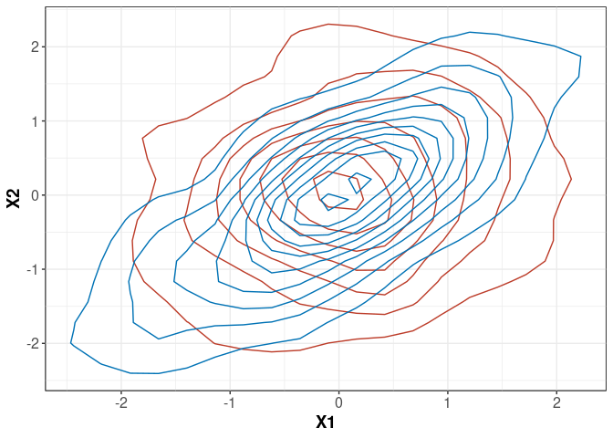
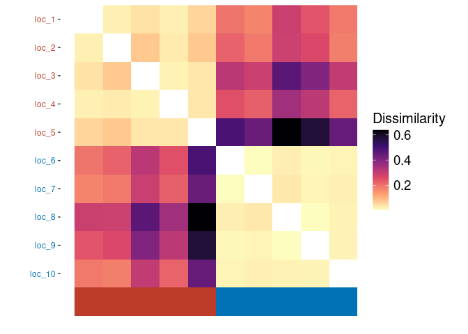

<!-- README.md is generated from README.Rmd. Please edit that file -->

# CeCl

<!-- use `devtools::build_readme()` or `rmarkdown::render()` to update README.md -->
<!-- badges: start -->

[](https://www.repostatus.org/#concept)
[](https://github.com/mrc-ide/CeCl/actions/workflows/R-CMD-check.yaml)
<!-- [](https://codecov.io/github/mrc-ide/CeCl?branch=main) -->
<!-- badges: end -->

<!-- `CeCl` (Conditional extremes Clustering, pronounced 'Cecil') is an R package which implements the method described in [O'Toole et al.](https://arxiv.org/abs/2510.20424) [-@otoole2025] for clustering multivariate extreme events based on their tail dependence structures using the conditional extremes model of Heffernan and Tawn [-@Heffernan2004]. -->

`CeCl` (Conditional extremes Clustering, pronounced “Cecil”) is an R
package for clustering multivariate extreme events. It implements the
method of [O’Toole et al.](https://arxiv.org/abs/2510.20424) (2025),
which uses the conditional extremes model of Heffernan and Tawn (2004)
to characterise tail-dependence. For more details of the methodology and
usage of the package, please see its vignette by running
`vignette("CeCl")` after installation. This package is in the early
stages of development; please report any issues or suggestions on the
[GitHub issues page](https:/github.com/potoole7/CeCl/issues). For
fitting the conditional extremes model, this package uses code adapted
from the `texmex` package (Southworth et al., 2020).

## Installation

You can install the development version of `CeCl` from
[GitHub](https://github.com/) with:

``` r
# install.packages("pak")
pak::pak("potoole7/CeCl")
```

## Quick usage

<!-- Once installed, you can apply the main `CeCl` workflow in three steps: -->

Once installed, the main `CeCl` workflow consists of three steps:

``` r
marg  <- cecl_marg(data)  # performs marginal transformation
dep   <- cecl_dep(marg)   # fits conditional extremes models
clust <- cecl_clust(dep)  # clusters based on tail dependence
```

For detailed options, see the function help pages
(`?cecl_marg, ?cecl_dep, ?cecl_clust`) or the vignette
(`vignette("CeCl")`).

## Example

Here’s a basic example of how to use `CeCl` to cluster locations based
on their tail dependence structures. Note that although we use spatial
terminology here, the method is applicable to any multivariate data, as,
for example, individuals in a clinical trial or financial assets in a
portfolio.

First, let’s generate some example data and visualise it. In this
example, we want to generate data for 10 “locations” (clustered into 2
groups of 5 sites each) from a bivariate t-copula with Generalised
Pareto marginals, with different correlation parameters for different
clusters.

``` r
library(CeCl)
library(copula)
library(dplyr)
library(ggplot2)

# function to generate multivariate t data with specified correlation
gen_t <- \(cor_t, n_vars = 2, n = 1000, n_locs = 5) {
  # generate data
  cop_t <- tCopula(param = cor_t, dim = n_vars, df = 3, dispstr = "ex")
  u <- rCopula(n, cop_t)
  data <- data.frame(apply(u, 2, qgpd, xi = -0.05, sigma = 1, u = 0))
}

# generate data for two different correlation settings
set.seed(123)
data <- rbind(
  gen_t(cor_t = 0.2), # first 5 locations have low correlation
  gen_t(cor_t = 0.8)  # last 5 locations have high correlation
)
# Add dummy location names
data$name <- rep(paste0("loc_", 1:10), each = 200)

# visualise
data |> 
  mutate(cluster = ifelse(name %in% paste0("loc_", 1:5), "A", "B")) |>
  ggplot(aes(x = X1, y = X2, color = cluster)) +
  geom_density_2d(show.legend = FALSE) + 
  cecl_theme()
```



The two “true” clusters of locations clearly visible in our plot will
have different tail dependence structures.

Now, we can use `CeCl` to try and recover these clusters based on their
tail dependence structure. First, we perform an empirical transformation
of the marginal data to standard Laplace margins, and then fit the
conditional extremes model to each location.

``` r
# use ECDF to perform marginal transformation, thresholding at 90th percentile
marg <- cecl_marg(
  data,
  thresh_method = "quantile",
  thresh_args = 0.9,
  marg_method = "ecdf"
)
# see `help(cecl_marg)` for details on arguments and available methods

# fit conditional extremes model to each location at 90th dependence quantile
dep <- cecl_dep(obj = marg, cond_prob = 0.9)
# again, see `help(cecl_dep)` for details on arguments and available methods
```

Finally, we can cluster the locations into two clusters based on the
fitted conditional extremes models.

``` r
# Cluster the fitted dependence models into 2 clusters
(clust <- cecl_clust(
  dep,
  marg_obj = marg,
  k = 2,
  cluster_mem = sort(rep(c(1, 2), times = 5)), # known cluster membership
  seed = 123
))
#> Clustering results of class 'cecl_clust'
#> Number of locations: 10 
#> Number of clusters: 2 
#> Adjusted Rand index: 1
```

We can visualise the dissimilarity matrix used for clustering as
follows:

``` r
ggplot(clust, which = "image")
```


The Adjusted Rand Index reported in the `cecl_clust` object confirms
that the clustering has perfectly recovered the true clusters of
locations based on their tail-dependence structures. Our dissimilarity
matrix plot also clearly shows two distinct clusters of locations.

## License

This project is licensed under the MIT License - see the
[LICENSE](LICENSE) file for details.

## References

<div id="refs" class="references csl-bib-body hanging-indent"
line-spacing="2">

<div id="ref-Heffernan2004" class="csl-entry">

Heffernan, J. E., & Tawn, J. A. (2004). A conditional approach for
multivariate extreme values (with discussion). *Journal of the Royal
Statistical Society Series B: Statistical Methodology*, *66*(3),
497–546.

</div>

<div id="ref-otoole2025" class="csl-entry">

O’Toole, P., Rohrbeck, C., & Richards, J. (2025). *Clustering of
multivariate tail dependence using conditional methods*.
<https://arxiv.org/abs/2510.20424>

</div>

<div id="ref-texmex" class="csl-entry">

Southworth, H., Heffernan, J. E., & Metcalfe, P. D. (2020). *Texmex:
Statistical modelling of extreme values*.

</div>

</div>
